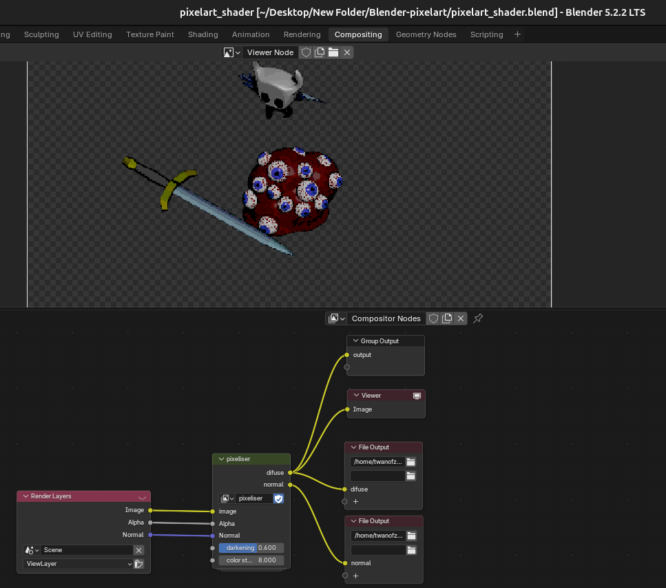
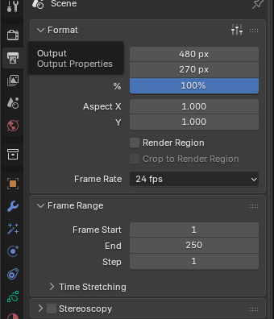

# Blender Pixel Art Render Pipeline

This is a Blender render pipeline designed to generate pixel art sprites from 3D models.

For each rendered frame, the pipeline generates:

* A **diffuse `.png`** containing the pixel-art sprite
* A **normal `.png`** containing the corresponding normal map

The output files are saved to the specified output directory.

## Usage

### 1. Configure the output paths

Open the **Compositing** tab in Blender:

Change the **File Output** paths to the directories where you want the rendered images to be saved.

### 2. Adjust the pixel-art settings

If needed, modify the parameters in the `pixelise` function:

* **Color Steps** — Controls the number of color levels used when clamping the image.
* **Darkening** — Adjusts the brightness of the diffuse output.

### 3. Disable the normal-map output

If you do not need normal maps, remove the **File Output** node connected to the `normal` output.

### 4. Change the pixel resolution

The pixelisation level can be adjusted through the **Pixel Count** setting in Blender's rendering/output settings.

A lower pixel count produces a more pixelated result, while a higher pixel count produces more detail.

## Utils Collection

The `utils` collection contains several components used by the pipeline:

### Lineart

* Controls the outline of the pixel art.
* Can be edited to change the appearance of the outline.
* Can be removed if lineart is not desired.
* Renders lineart for objects in the `renders` collection.

### Camera

* Can be switched to a different perspective mode.
* Can be rotated to create a different viewing angle.

### Sun

The `Sun` provides global directional illumination.

* Change its angle to modify the direction of the lighting.
* Replace it with another lighting setup if desired.
* Change its color to alter the overall lighting.

## Customization

All components in the `utils` collection can be edited or replaced without affecting the core pixel-art conversion process.

This allows you to customize the **camera, lighting, and lineart** while keeping the underlying conversion pipeline intact.
